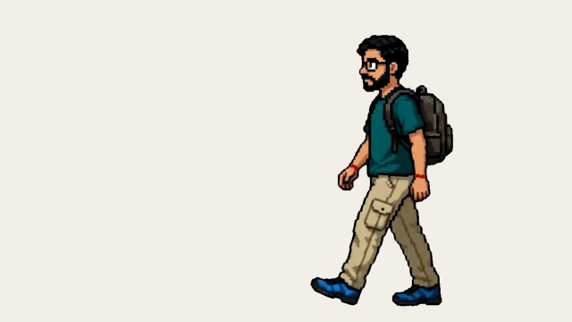

# PostureBuddy

A macOS menu-bar app that watches your posture through your AirPods. When you
slouch, a pixel-art version of *you* walks onto your screen and tells you to sit
straight.

<p align="center">
  
</p>

<p align="center">
  <em>Slouch for 5 seconds and your pixel self walks in from the corner of your screen.</em>
</p>

## How it works

PostureBuddy reads AirPods head-tilt via `CMHeadphoneMotionManager` through its
own small posture engine (`PostureBuddy/Motion/` — sample validation, low-pass
filtering, posture classification, guided calibration). When your head stays tilted past your
calibrated threshold for ~5 seconds, your pixel-art character walks in from the
bottom-right corner of your screen, stops, yells at you, and holds up a speech
bubble roasting your posture:

> *Nice hunchback. Very medieval.*
> *You're folding like a cheap lawn chair.*
> *Gravity: 1. You: 0.*

A random line every time, never the same one twice in a row. It waits there —
click-through, never stealing focus — until you've held good posture for a couple
of seconds, then fades away. Sound can be muted from the menu.

## Requirements

- macOS 14+
- AirPods with head tracking (AirPods Pro, AirPods 3rd gen+, AirPods Max, or
  compatible Beats)
- Xcode 16+, XcodeGen (`brew install xcodegen`)

## Build & run

```bash
xcodegen generate
open PostureBuddy.xcodeproj   # then Run, or:
xcodebuild -scheme PostureBuddy -destination 'platform=macOS' build
```

## Test

```bash
xcodebuild test -scheme PostureBuddy -destination 'platform=macOS'
```

## Menu

- **Monitor my posture** — pause/resume nagging
- **Play sound** — mute the character's sound effect
- **Sensitivity** — adjust the head-tilt threshold (Strict ↔ Relaxed)
- **Recalibrate…** — re-run the guided good/slouch calibration
- **Quit**

## Notes

- **Make it look like you.** The character is just an animated GIF bundled at
  `PostureBuddy/Resources/posturebuddy.gif` (source art in `assets/`). Swap in a
  pixel-art GIF of yourself and it works: `GIFPlayerView` reads the frame count and
  delays from the GIF, and the speech bubble is timed off its duration. Use a
  **transparent background** so the character floats on your desktop; have it walk
  in from the right and end standing, since it plays once and holds the last frame.
  Layout knobs are at the top of `PetOverlayWindowController.swift`.
- **Make it say your own things.** Edit `NagMessages.all`. The sound effect is
  `PostureBuddy/Resources/faaah.mp3` — replace the file to change it.
- The posture engine (`PostureBuddy/Motion/` — filter, classification, connection
  tracking, calibration) is part of the app target; this project has no external
  dependencies.
- Depends on nothing over the network; no analytics.
